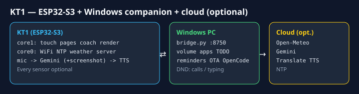
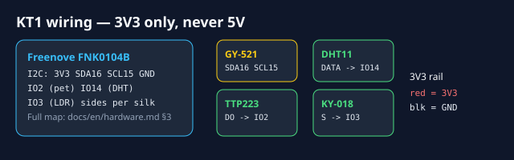

<div align="center">

# KT1 DeskPet · mascota de escritorio

[](LICENSE)
[](docs/es/hardware.md)
[](platformio.ini)
[](https://github.com/danigtalh/kt1-deskpet/actions/workflows/build.yml)
[](docs/es/installation.md)

**Un compañero de escritorio con ojos expresivos que te hace moverte, te ayuda a concentrarte y habla contigo.**
ESP32-S3 · pantalla táctil de 2,8" · voz · sensores · compañero para Windows




> 🧪 ¿Sin hardware todavía? Prueba la lógica en tu navegador: importa `diagram.json` en [Wokwi](https://wokwi.com/new/esp32-s3-devkitc-1) (ESP32-S3 genérico + ILI9341 + MPU6050 + DHT + botón; el cableado real del FNK0104B está en [hardware.md](docs/es/hardware.md#3-mapa-de-conexiones)).

[](README.md) [](README.es.md)

[Demo](#demo) · [Funciones](#funciones) · [Componentes](#componentes) · [Conexiones](#conexiones) · [Instalación](#instalación) · [Documentación](#documentación)

</div>

---

## Demo

<!--
  HUECOS PARA VÍDEOS: arrastra cada .mp4 al editor web de GitHub en esta línea (GitHub lo
  convierte en un enlace https://github.com/user-attachments/assets/... y lo reproduce
  integrado), o consulta docs/media/README.md. Sustituye el bloque de cita completo de cada hueco.
-->

### 1. Vista general
> 🎬 **Vídeo pendiente** — *KT1 en el escritorio: cara, páginas y navegación.*

### 2. Estados de ánimo, inclinación y caricias
> 🎬 **Vídeo pendiente** — *estados de ánimo, ojos que siguen la inclinación (IMU), mareo al agitarlo, caricias con el sensor táctil.*

### 3. Ciclo de ejercicio y pausa activa
> 🎬 **Vídeo pendiente** — *aviso de postura, entrenador con cuenta atrás y pitidos por repetición.*

### 4. Pomodoro y plantas
> 🎬 **Vídeo pendiente** — *modo pomodoro y una medición de planta.*

### 5. Asistente de voz y control del PC
> 🎬 **Vídeo pendiente** — *pregunta por voz, respuesta hablada y un comando al PC (volumen, abrir app…).*

### 6. Cambio de idioma
> 🎬 **Vídeo pendiente** — *cambio English ↔ Español en la página Pantalla (Screen).*

---

## Funciones

- 👀 **Ojos expresivos** dibujados en tiempo real: 10 estados de ánimo, parpadeo, gestos en reposo;
  siguen tu dedo y la inclinación del dispositivo, y se marean si lo agitas.
- 🧍 **Entrenador de movimiento** para mesas elevables: 20 min sentado → 8 min de pie → 2 min de
  movimiento (Cornell), pausas activas guiadas con mancuernas o movilidad, estadísticas diarias.
- 🍅 **Pomodoro** con modos *Trabajo / Escritura / Ocio* y ánimos suaves.
- 🪴 **Plantas**: mide luz, temperatura y humedad y te dice si el sitio le viene bien a tu
  planta.
- 🌤️ **Tiempo** (Open-Meteo, sin clave) y **reloj** sincronizado por NTP.
- 🗣️ **Asistente de voz** (Google Gemini): ve la pantalla de tu PC, controla el volumen, las apps,
  recordatorios, notas, memoria, no molestar y una sesión de programación de OpenCode.
- 💻 **Compañero para Windows** (`pc-agent`): sabe cuándo estás en una llamada o escribiendo para no
  interrumpirte nunca en mal momento; actualizaciones de firmware inalámbricas.
- 🌐 **Inglés / español**, se cambia en el propio dispositivo y se guarda en flash.
- 🔌 Todos los sensores son **opcionales**: arranca y funciona sin ellos.

## Componentes

| Componente | ¿Obligatorio? | Función |
|---|:-:|---|
| Freenove **ESP32-S3 Display FNK0104B** (ILI9341 de 2,8" + táctil FT6336U + audio ES8311 + WS2812) | ✅ | Cerebro, pantalla, táctil, micro/altavoz |
| Cable USB-C de datos + cargador de 5 V ≥ 1 A | ✅ | Alimentación / programación |
| **GY-521** (MPU6050) | Opcional | Inclinación y agitado |
| Módulo táctil **TTP223** (o KY-036) | Opcional | Caricias / pulsar para hablar |
| **DHT11** | Opcional | Temperatura y humedad (Plantas) |
| LDR **KY-018** | Opcional | Luz (Plantas) |
| Cables Dupont, mancuernas, carcasa | Opcional | — |

Lista completa, pines de la placa y notas de seguridad: **[docs/es/hardware.md](docs/es/hardware.md)**.

## Conexiones

| Módulo | Pin del módulo → Placa |
|---|---|
| GY-521 | VCC → **3V3** · GND → **GND** · SDA → **IO16** · SCL → **IO15** (conector I2C de la placa) |
| TTP223 | VCC → **3V3** · GND → **GND** · DO → **IO2** |
| DHT11 | VCC → **3V3** · GND → **GND** · DATA → **IO14** |
| KY-018 | + → **3V3** · − → **GND** · S → **IO3** |

> ⚠️ Todos los módulos a **3,3 V**, nunca a 5 V. Esquema de conexiones y direcciones I2C en
> [hardware.md](docs/es/hardware.md#3-mapa-de-conexiones).

## Instalación

Versión rápida (tutorial paso a paso con comprobaciones en **[docs/es/installation.md](docs/es/installation.md)**):

**Opción A — PlatformIO (recomendado, un comando):**
```bash
pip install platformio
cp firmware/kt1-deskpet/secrets.example.h firmware/kt1-deskpet/secrets.h
pio run -e kt1   # build Huge APP; usa -e kt1-ota para actualizaciones inalámbricas
```

**Opción B — Arduino IDE 2.x:**

1. Arduino IDE 2.x + núcleo **esp32** 3.x; librerías **TFT_eSPI** (configuración de Freenove), **ArduinoJson 7**,
   **Freenove WS2812**, **ESP32-audioI2S 2.0.0**.
2. En `TFT_eSPI/User_Setup_Select.h` activa solo `FNK0104AB_2P8_240x320_ILI9341`.
3. Copia `firmware/kt1-deskpet/secrets.example.h` → `secrets.h` y rellena la Wi-Fi y la ciudad.
4. *ESP32S3 Dev Module* · USB CDC On Boot *Enabled* · PSRAM *OPI* · Flash *16MB* ·
   Partition *16M Flash (3MB APP/9.9MB FATFS)* → **Upload**.
5. Opcional: clave de Gemini para la voz y, en Windows, `cd pc-agent && pip install -r requirements.txt && python setup.py`.

## Documentación

| | Español | English |
|---|---|---|
| Componentes y conexiones | [hardware.md](docs/es/hardware.md) | [hardware.md](docs/en/hardware.md) |
| Tutorial de instalación | [installation.md](docs/es/installation.md) | [installation.md](docs/en/installation.md) |
| Uso, páginas y comandos de voz | [usage.md](docs/es/usage.md) | [usage.md](docs/en/usage.md) |
| Compañero de PC y API | [pc-agent.md](docs/es/pc-agent.md) | [pc-agent.md](docs/en/pc-agent.md) |
| Solución de problemas | [troubleshooting.md](docs/es/troubleshooting.md) | [troubleshooting.md](docs/en/troubleshooting.md) |

## Cómo funciona

```
 ┌──────────────── KT1 (ESP32-S3) ────────────────┐         ┌──────────── Windows PC ────────────┐
 │ core 1: touch · pages · cycle · coach · render  │  HTTP   │ pet_agent.py  app / idle / mic in   │
 │ core 0: Wi-Fi · NTP · weather · web server      │◄───────►│   use → POST /pet                   │
 │         IMU 100 Hz · sound queue (ES8311)       │         │ bridge.py  :8750  volume, apps,     │
 │ chat: mic → Gemini (+PC screenshot) → TTS       │────────►│   TODO, reminders, memory, OTA,     │
 └─────────────────────────────────────────────────┘         │   OpenCode CLI                      │
            │ HTTPS                                           └─────────────────────────────────────┘
            ▼
   Open-Meteo · Google Gemini · Google Translate TTS · NTP
```

```
firmware/kt1-deskpet/   Arduino sketch (.ino + modules .h)
  lang.h          UI languages (TR("English", "Spanish"))
  exercises.h     editable exercise library
  secrets.example.h   template → copy to secrets.h (git-ignored)
pc-agent/         Windows companion (Python): bridge.py, pet_agent.py, setup.py, watchdog.py
docs/en, docs/es  documentation in both languages · docs/media: videos
```

## Privacidad y seguridad

- Los secretos solo están en `secrets.h` y `pc-agent/setup.json`, ambos ignorados por git, igual que
  el firmware compilado `.bin` (lleva tus credenciales incrustadas), `audit.log` y `memory.json`.
- El chat de voz envía el audio y una captura de pantalla del PC a Google Gemini, y el texto de la
  respuesta a Google Translate TTS. Sin clave de Gemini no se envía nada.
- `bridge.py` escucha en tu red local por HTTP sin cifrar, protegido por un token
  (`X-Bridge-Token`), un límite de peticiones y una **lista de apps permitidas**. No lo expongas a internet.
- Las llamadas HTTPS desde el ESP32 no validan certificados (`setInsecure`): aceptable para
  datos públicos, tenlo en cuenta en el caso de la clave de Gemini.

## Limitaciones conocidas

- La OTA necesita un esquema de particiones con dos huecos de aplicación (ver instalación §11).
- El turno de voz es bloqueante (~3–8 s) y graba como máximo 4–5 s.
- El `PROMPT` a OpenCode es de tipo «dispara y olvida» (la respuesta no se transmite a KT1).
- `pc-agent` solo funciona en Windows.

## Proyectos similares y créditos

KT1 no es otra demo de "ojos": añade entrenador de movimiento Cornell 20-8-2, pomodoro,
medición de plantas y compañero de voz para Windows que respeta llamadas/escritura (DND,
prompts a OpenCode) en un FNK0104B con táctil + voz.

| Proyecto | Estrellas* | En qué destaca | Diferencia de KT1 |
|---|---|---|---|
| [78/xiaozhi-esp32](https://github.com/78/xiaozhi-esp32) | ~30k | Voz LLM en 138 placas, OTA + flasheo web, gran comunidad | Una sola placa, entrenador + plantas + pomodoro |
| [playfultechnology/esp32-eyes](https://github.com/playfultechnology/esp32-eyes) | ~370 | Librería de ojos reutilizable, esquema + API | Producto completo: páginas, entrenador, voz, PC agent |
| [SukunDev/ESP32-Pet-Robot](https://github.com/SukunDev/ESP32-Pet-Robot) | ~24 | Simulador Wokwi, barrera baja | Misma idea + Wokwi (`diagram.json`) + placa táctil/voz |
| [FamousWolf/deskbuddy](https://github.com/FamousWolf/deskbuddy) | ~13 | ESPHome + medidor de felicidad en Home Assistant | Autónomo + voz Gemini + control dev con OpenCode |

\* Estrellas al escribir esto (oct 2026), para posicionar — no para competir.

Ideas y estructura de la documentación inspiradas en otros compañeros de escritorio:
[playfultechnology/esp32-eyes](https://github.com/playfultechnology/esp32-eyes),
[FamousWolf/deskbuddy](https://github.com/FamousWolf/deskbuddy),
[RolfKoenders/Deskbuddy](https://github.com/RolfKoenders/Deskbuddy),
[LextZip/Deskbuddy](https://github.com/LextZip/Deskbuddy),
[SukunDev/ESP32-Pet-Robot](https://github.com/SukunDev/ESP32-Pet-Robot).
Driver ES8311 © Espressif Systems (Apache-2.0). Soporte de la placa por
[Freenove](https://github.com/Freenove/Freenove_ESP32_S3_Display).

## Licencia

[MIT](LICENSE) — excepto los archivos del driver ES8311 (Apache-2.0, ver sus cabeceras).

---

<div align="center">

[](README.md) [](README.es.md)

</div>
