<div align="center">

# KT1 DeskPet · desk companion

[](LICENSE)
[](docs/en/hardware.md)
[](platformio.ini)
[](https://github.com/Amloii/KT1-deskpet/actions/workflows/build.yml)
[](docs/en/installation.md)

**A desk companion with expressive eyes that nags you to stand up and answers when you talk to it.**
ESP32-S3 · 2.8" touch screen · voice · sensors · Windows companion

<p align="center">
  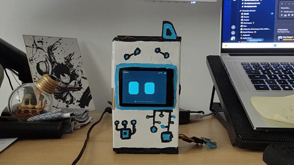
</p>
<p align="center"><em>KT1 live on the desk — face, pages and navigation.</em></p>


> 🧪 No hardware yet? Try the logic in your browser: import `diagram.json` into [Wokwi](https://wokwi.com/new/esp32-s3-devkitc-1) (generic ESP32-S3 + ILI9341 + MPU6050 + DHT + button; the real FNK0104B wiring is in [hardware.md](docs/en/hardware.md#3-wiring-map)).

[](README.md) [](README.es.md)

[Demo](#demo) · [Features](#features) · [Components](#components) · [Wiring](#wiring) · [Installation](#installation) · [Docs](#documentation)

</div>

---

KT1 sits next to your keyboard and watches you work. Its eyes follow your finger, lean
when you lean the board, and go unfocused if you shake it. It keeps count of how long you
have been sitting and tells you to get up. It runs your pomodoros, checks whether your
plant is getting enough light, and answers out loud when you ask it something. If your
microphone is live it stays quiet until the call is over.

## Demo

<p align="center">
  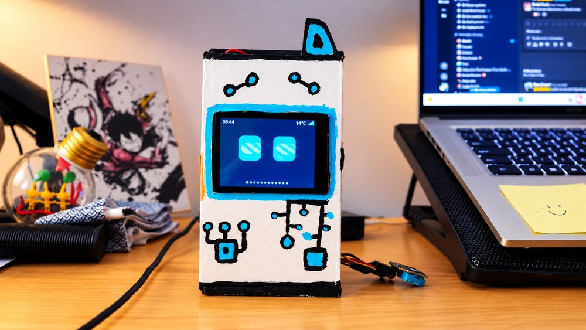
  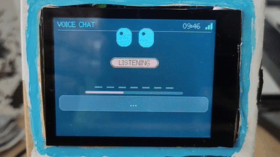
</p>
<p align="center"><em>Left: the one and only KT1 — yes, the case is a painted cardboard box: no 3D printer here, just personality (and a lot of blue paint). Right: voice chat — ask, thinking, spoken answer.</em></p>

### Screens

<table>
  <tr>
    <td align="center" width="33%">
      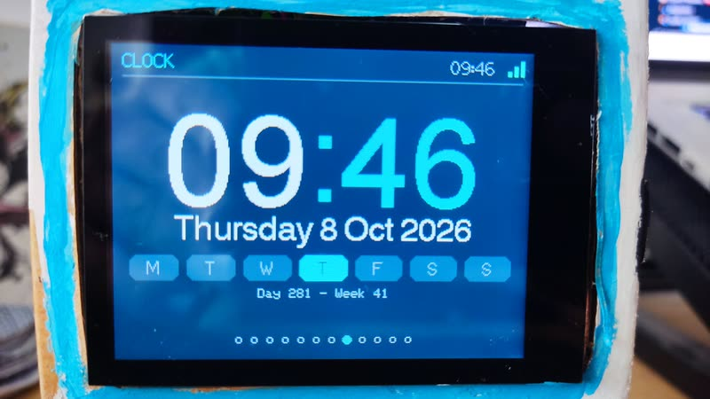<br>
      <b>Face / Clock</b><br>
      Clock with date, weather mini-icon and Cornell cycle state
    </td>
    <td align="center" width="33%">
      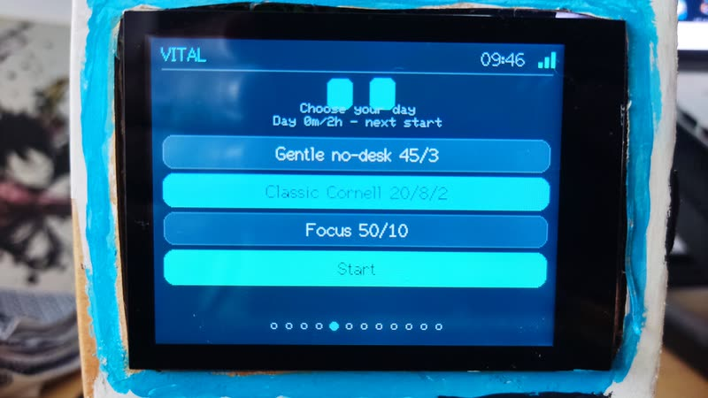<br>
      <b>Vital day plan</b><br>
      Choose your day: Gentle 45/3, Classic Cornell 20/8/2, Focus 50/10
    </td>
    <td align="center" width="33%">
      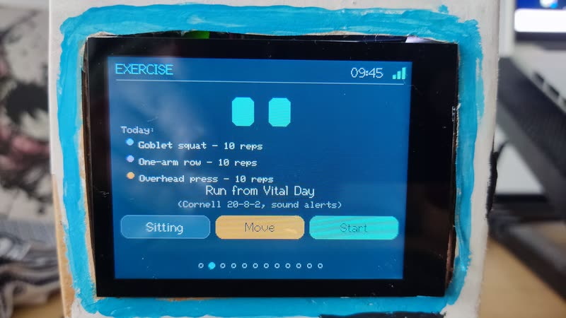<br>
      <b>Exercise break</b><br>
      Guided break: Goblet squat, One-arm row, Overhead press
    </td>
  </tr>
  <tr>
    <td align="center" width="33%">
      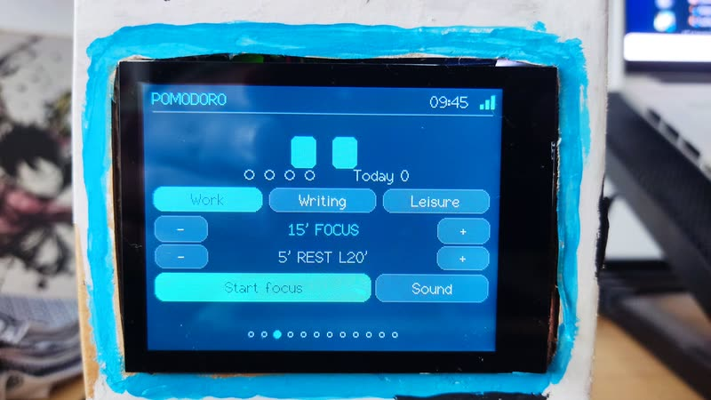<br>
      <b>Pomodoro setup</b><br>
      Work / Writing / Leisure, focus + rest length
    </td>
    <td align="center" width="33%">
      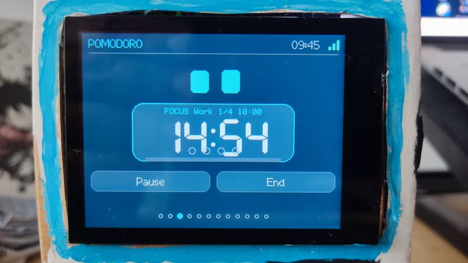<br>
      <b>Pomodoro focus</b><br>
      FOCUS Work 1/4 countdown with Pause / End
    </td>
    <td align="center" width="33%">
      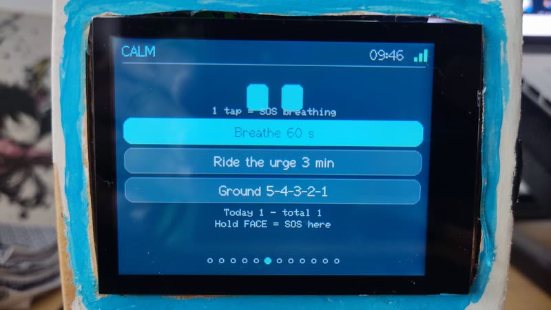<br>
      <b>Calm SOS</b><br>
      60 s breathing, 3 min urge surfing, 5-4-3-2-1 grounding
    </td>
  </tr>
  <tr>
    <td align="center" width="33%">
      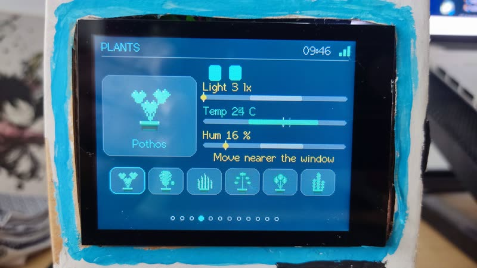<br>
      <b>Plants</b><br>
      Light / temp / humidity vs Pothos needs, "Move nearer the window"
    </td>
    <td align="center" width="33%">
      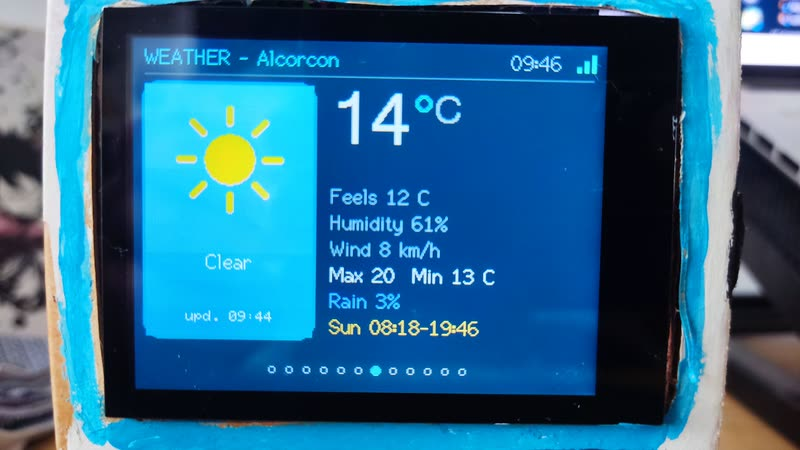<br>
      <b>Weather</b><br>
      Open-Meteo: now, feels-like, wind, rain, sunrise/sunset
    </td>
    <td align="center" width="33%">
      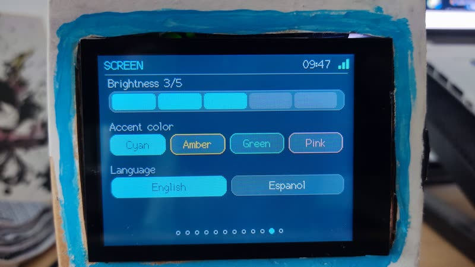<br>
      <b>Screen settings</b><br>
      Brightness, accent color, English / Español
    </td>
  </tr>
</table>

<details>
<summary>🎬 Extra clips pending</summary>

<!--
  VIDEO SLOTS: to play inline on GitHub, drag each .mp4 into the GitHub web editor
  on this line (GitHub turns it into a https://github.com/user-attachments/assets/...
  link). Demos already covered by GIFs above; add new clips only.
-->

### 1. Overview — done


### 2. Moods, tilt and petting
> 🎬 **Video pending**: *moods, eyes following the tilt (IMU), dizzy on shake, petting with the touch sensor.*

### 3. Exercise cycle and active break
> 🎬 **Video pending**: *posture nudge, coach with countdown and rep beeps.*

### 4. Pomodoro and plants
> 🎬 **Video pending**: *pomodoro mode and a plant measurement.*

### 5. Voice assistant and PC control — done


### 6. Language switch
> 🎬 **Video pending**: *changing English ↔ Español on the Screen page (see photo above).*

</details>

---

## Features

- 👀 **Expressive eyes** drawn in real time: 10 moods, blinking, idle gestures, they follow
  your finger and the tilt of the device, and get dizzy if you shake it.
- 🧍 **Movement coach** for standing desks: 20 min sitting → 8 min standing → 2 min of
  movement (Cornell), guided active breaks with dumbbells or mobility, daily stats.
- 🍅 **Pomodoro** with *Work / Writing / Leisure* modes and gentle encouragement.
- 🧘 **Calm** SOS window for tension, stress or craving: 60 s breathing, 3 min urge
  surfing and 5-4-3-2-1 grounding, plus a PC window with 5 min DND.
- 🪴 **Plants**: measures light, temperature and humidity and tells you whether the spot
  suits your plant.
- 🌤️ **Weather** (Open-Meteo, no key) and **clock** synced by NTP.
- 🗣️ **Voice assistant** (Google Gemini): sees your PC screen, controls volume, apps,
  reminders, notes, memory, do-not-disturb and an OpenCode coding session.
- 💻 **Windows companion** (`pc-agent`): knows when you are on a call or typing so it never
  interrupts at the wrong moment; wireless firmware updates.
- 🌐 **English / Spanish**, switchable on the device and saved in flash.
- 🔌 Every sensor is **optional**: it boots and works without them.

## Components

| Component | Required? | Role |
|---|:-:|---|
| Freenove **ESP32-S3 Display FNK0104B** (2.8" ILI9341 + FT6336U touch + ES8311 audio + WS2812) | ✅ | Brain, screen, touch, mic/speaker |
| USB-C data cable + 5 V ≥ 1 A charger | ✅ | Power / programming |
| **GY-521** (MPU6050) | Optional | Tilt and shake |
| **TTP223** touch module (or KY-036) | Optional | Petting / push-to-talk |
| **DHT11** | Optional | Temperature and humidity (Plants) |
| **KY-018** LDR | Optional | Light (Plants) |
| Dupont wires, dumbbells, case | Optional | — |

Full list, board pinout and safety notes: **[docs/en/hardware.md](docs/en/hardware.md)**.

## Wiring


<p align="center">
  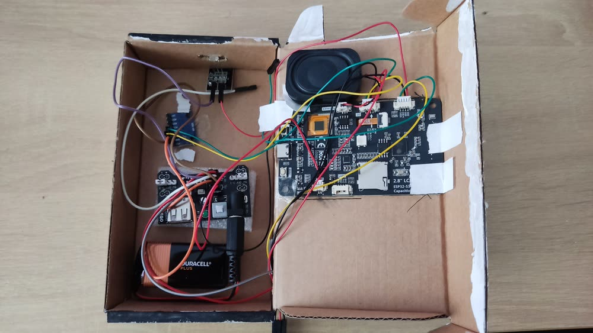
</p>
<p align="center"><em>Real build: ESP32-S3 display with GY-521, TTP223, DHT11 and KY-018 wired with Dupont cables.</em></p>

| Module | Module pin → Board |
|---|---|
| GY-521 | VCC → **3V3** · GND → **GND** · SDA → **IO16** · SCL → **IO15** (board I2C connector) |
| TTP223 | VCC → **3V3** · GND → **GND** · DO → **IO2** |
| DHT11 | VCC → **3V3** · GND → **GND** · DATA → **IO14** |
| KY-018 | + → **3V3** · − → **GND** · S → **IO3** |

> ⚠️ All modules at **3.3 V**, never 5 V. Wiring diagram and I2C addresses in
> [hardware.md](docs/en/hardware.md#3-wiring-map).

## Installation

Quick version (step-by-step tutorial with checks in **[docs/en/installation.md](docs/en/installation.md)**):

**Option A: PlatformIO** (recommended, one command)
```bash
pip install platformio
cp firmware/kt1-deskpet/secrets.example.h firmware/kt1-deskpet/secrets.h
pio run -e kt1   # Huge APP build; use -e kt1-ota for wireless updates
```
On PowerShell, replace the `cp` line with
`copy firmware\kt1-deskpet\secrets.example.h firmware\kt1-deskpet\secrets.h`.

**Option B: Arduino IDE 2.x**

1. Arduino IDE 2.x + **esp32** core 3.x; libraries **TFT_eSPI** (Freenove setup), **ArduinoJson 7**,
   **Freenove WS2812**, **ESP32-audioI2S 2.0.0**.
2. In `TFT_eSPI/User_Setup_Select.h` enable only `FNK0104AB_2P8_240x320_ILI9341`.
3. Copy `firmware/kt1-deskpet/secrets.example.h` → `secrets.h` and fill in Wi-Fi and city.
4. *ESP32S3 Dev Module* · USB CDC On Boot *Enabled* · PSRAM *OPI* · Flash *16MB* ·
   Partition *16M Flash (3MB APP/9.9MB FATFS)* → **Upload**.
5. Optional: Gemini key for voice, and on Windows `cd pc-agent && pip install -r requirements.txt && python setup.py`.

## Documentation

| | English | Español |
|---|---|---|
| Components and wiring | [hardware.md](docs/en/hardware.md) | [hardware.md](docs/es/hardware.md) |
| Installation tutorial | [installation.md](docs/en/installation.md) | [installation.md](docs/es/installation.md) |
| Usage, pages and voice commands | [usage.md](docs/en/usage.md) | [usage.md](docs/es/usage.md) |
| PC companion and API | [pc-agent.md](docs/en/pc-agent.md) | [pc-agent.md](docs/es/pc-agent.md) |
| Troubleshooting | [troubleshooting.md](docs/en/troubleshooting.md) | [troubleshooting.md](docs/es/troubleshooting.md) |

## How it works

```
 ┌──────────────── KT1 (ESP32-S3) ────────────────┐         ┌─────────── Windows PC ────────────┐
 │ core 1: touch · pages · cycle · coach · render │  HTTP   │ pet_agent.py  app / idle / mic in │
 │ core 0: Wi-Fi · NTP · weather · web server     │◄───────►│   use → POST /pet                 │
 │         IMU 100 Hz · sound queue (ES8311)      │         │ bridge.py  :8750  volume, apps,   │
 │ chat: mic → Gemini (+PC screenshot) → TTS      │────────►│   TODO, reminders, memory, OTA,   │
 └────────────────────────────────────────────────┘         │   OpenCode CLI                    │
            │ HTTPS                                         └───────────────────────────────────┘
            ▼
   Open-Meteo · Google Gemini · Google Translate TTS · NTP
```

```
firmware/kt1-deskpet/   Arduino sketch (.ino + modules .h)
  lang.h          UI languages (TR("English", "Spanish"))
  exercises.h     editable exercise library
  secrets.example.h   template → copy to secrets.h (git-ignored)
pc-agent/         Windows companion (Python): bridge.py, pet_agent.py, calm_window.py, setup.py, watchdog.py
docs/en, docs/es  documentation in both languages · docs/media: videos
```

## Privacy and security

- Secrets live only in `secrets.h` and `pc-agent/setup.json`. Both are git-ignored, along
  with the compiled firmware `.bin` (it embeds your credentials), `audit.log` and `memory.json`.
- The voice chat sends audio and a PC screenshot to Google Gemini and the answer text to
  Google Translate TTS. Without a Gemini key nothing is sent.
- `bridge.py` listens on your LAN over plain HTTP, protected by a token
  (`X-Bridge-Token`), a rate limit and an app **allowlist**. Do not expose it to the internet.
- HTTPS calls from the ESP32 do not validate certificates (`setInsecure`): acceptable for
  public data, keep it in mind for the Gemini key.

## Known limitations

- OTA needs a partition scheme with two app slots (see installation §11).
- The voice turn is blocking (~3–8 s) and records 4–5 s maximum.
- `PROMPT` to OpenCode is fire-and-forget (the answer is not streamed to KT1).
- `pc-agent` is Windows-only.

## Similar projects and credits

Several desk pets already draw good eyes. What KT1 adds on top is desk health: a Cornell
20-8-2 movement coach, pomodoro, plant sensing and a Windows voice companion that goes
quiet during calls and typing and can send prompts to OpenCode, all on a touch + voice
FNK0104B.

| Project | Stars* | What it does well | KT1 difference |
|---|---|---|---|
| [78/xiaozhi-esp32](https://github.com/78/xiaozhi-esp32) | ~30k | Voice LLM on 138 boards, OTA + web flasher, huge community | Single-board focus, desk-health coach + plants + pomodoro |
| [playfultechnology/esp32-eyes](https://github.com/playfultechnology/esp32-eyes) | ~370 | Reusable eyes library, schematic + API docs | Full product: pages, coach, voice, PC agent |
| [SukunDev/ESP32-Pet-Robot](https://github.com/SukunDev/ESP32-Pet-Robot) | ~24 | Wokwi simulator, low entry barrier | Same idea + Wokwi (`diagram.json`) + touch/voice board |
| [FamousWolf/deskbuddy](https://github.com/FamousWolf/deskbuddy) | ~13 | ESPHome + Home Assistant happiness meter | Standalone + Gemini voice + OpenCode dev control |

\* Star counts from October 2026, for context.

Ideas and documentation structure inspired by other desk companions:
[playfultechnology/esp32-eyes](https://github.com/playfultechnology/esp32-eyes),
[FamousWolf/deskbuddy](https://github.com/FamousWolf/deskbuddy),
[RolfKoenders/Deskbuddy](https://github.com/RolfKoenders/Deskbuddy),
[LextZip/Deskbuddy](https://github.com/LextZip/Deskbuddy),
[SukunDev/ESP32-Pet-Robot](https://github.com/SukunDev/ESP32-Pet-Robot).
ES8311 driver © Espressif Systems (Apache-2.0). Board support by
[Freenove](https://github.com/Freenove/Freenove_ESP32_S3_Display).

## License

[MIT](LICENSE), except for the ES8311 driver files (Apache-2.0, see their headers).

---

<div align="center">

[](README.md) [](README.es.md)

</div>
